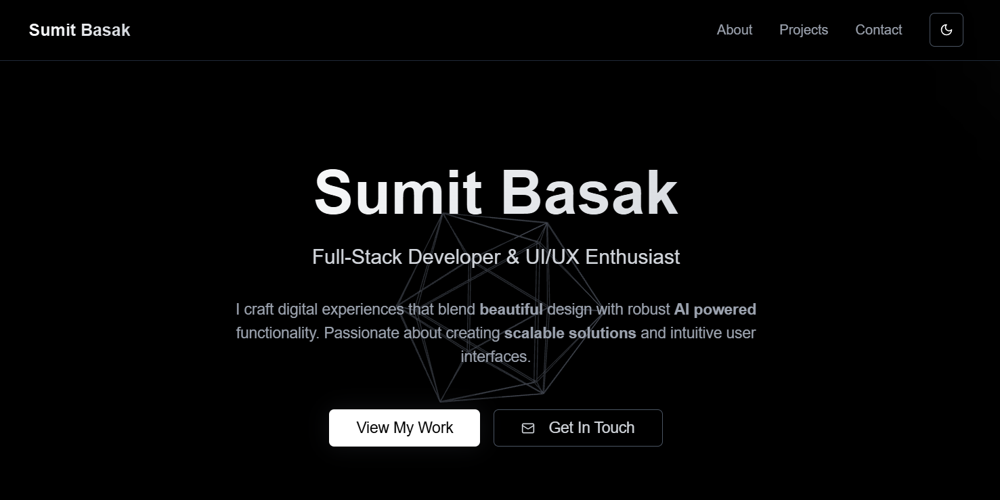

# Sumit Basak - Portfolio

[](https://nextjs.org/)
[](https://reactjs.org/)
[](https://www.typescriptlang.org/)
[](https://tailwindcss.com/)
[](https://threejs.org/)

A modern, interactive portfolio website built with Next.js, React Three Fiber, and Tailwind CSS. Features a stunning 3D animated background, dark/light theme toggle, and a comprehensive showcase of skills, projects, and experience.



## ✨ Features

- **🎨 Modern Design**: Clean, responsive design with smooth animations
- **🌙 Dark/Light Theme**: Toggle between dark and light modes
- **🎭 3D Background**: Interactive Three.js animated geometry using React Three Fiber
- **📱 Responsive**: Fully responsive design that works on all devices
- **⚡ Performance**: Optimized with Next.js 15 and React 19
- **📧 Contact Form**: Functional contact form with email integration
- **🎯 Smooth Scrolling**: Smooth navigation between sections
- **🔍 SEO Optimized**: Built with Next.js for optimal SEO performance

## 🛠️ Technologies Used

### Frontend

- **Next.js 15** - React framework with App Router
- **React 19** - Latest React with concurrent features
- **TypeScript** - Type-safe JavaScript
- **Tailwind CSS** - Utility-first CSS framework
- **Radix UI** - Accessible component primitives
- **Lucide React** - Beautiful icons

### 3D Graphics

- **Three.js** - 3D graphics library
- **React Three Fiber** - React renderer for Three.js
- **@react-three/drei** - Useful helpers for React Three Fiber

### Backend & APIs

- **Next.js API Routes** - Serverless API endpoints
- **Nodemailer** - Email sending functionality
- **Formik** - Form handling and validation
- **Yup** - Schema validation

### Development Tools

- **ESLint** - Code linting
- **PostCSS** - CSS processing
- **Autoprefixer** - CSS vendor prefixing

## 📁 Project Structure

```
portfolio/
├── app/                    # Next.js App Router
│   ├── api/               # API routes
│   │   └── send-mail/     # Contact form email API
│   ├── globals.css        # Global styles
│   ├── layout.tsx         # Root layout
│   └── page.tsx           # Home page
├── components/            # React components
│   ├── ui/               # Reusable UI components
│   ├── FloatingGeometry.tsx  # 3D background components
│   ├── theme-provider.tsx    # Theme context
│   └── theme-toggle.tsx      # Theme toggle component
├── hooks/                # Custom React hooks
├── lib/                  # Utility functions and data
│   ├── utils.ts          # Utility functions
│   └── values.ts         # Portfolio data (projects, skills, etc.)
├── providers/            # Context providers
├── public/               # Static assets
└── styles/               # Additional styles
```

## 🚀 Getting Started

### Prerequisites

- Node.js 18+
- npm, yarn, or pnpm

### Installation

1. **Clone the repository:**

   ```bash
   git clone https://github.com/TheSumitBasak/portfolio.git
   cd portfolio
   ```

2. **Install dependencies:**

   ```bash
   npm install
   # or
   yarn install
   # or
   pnpm install
   ```

3. **Set up environment variables:**
   Create a `.env.local` file in the root directory:

   ```env
   GMAIL_EMAIL=your-email@gmail.com
   GMAIL_PASSWORD=your-app-password
   ```

   > **Note**: For Gmail, you'll need to use an App Password instead of your regular password. Enable 2FA and generate an App Password in your Google Account settings.

4. **Start the development server:**

   ```bash
   npm run dev
   # or
   yarn dev
   # or
   pnpm dev
   ```

5. **Open [http://localhost:3000](http://localhost:3000) to view it in your browser.**

## 🎨 Customization

### Updating Portfolio Content

Edit `lib/values.ts` to update your:

- **Personal Information**: Name, bio, social links
- **Skills**: Technical skills and technologies
- **Projects**: Portfolio projects with descriptions, tech stack, and links
- **Experience**: Work history and achievements
- **Features**: Key highlights of your work

### Styling

- **Colors**: Modify Tailwind config in `tailwind.config.ts`
- **Theme**: Customize dark/light theme colors in `components/theme-provider.tsx`
- **3D Background**: Adjust animations in `components/FloatingGeometry.tsx`

### Adding New Sections

1. Add section data to `lib/values.ts`
2. Create new components in `components/`
3. Add section to main page in `app/page.tsx`

## 🚀 Deployment

### One-Click Deployment

Choose your preferred platform to deploy this portfolio:

[](https://vercel.com/new/clone?repository-url=https://github.com/TheSumitBasak/portfolio&env=GMAIL_EMAIL,GMAIL_PASSWORD&envDescription=Email%20credentials%20for%20contact%20form&envLink=https://github.com/TheSumitBasak/portfolio#contact-form-setup)

[](https://app.netlify.com/start/deploy?repository=https://github.com/TheSumitBasak/portfolio)

[](https://railway.app/template/new?template=https://github.com/TheSumitBasak/portfolio)

[](https://render.com/deploy?repo=https://github.com/TheSumitBasak/portfolio)

### Manual Deployment

#### Vercel (Recommended)

1. **Push to GitHub**:

   ```bash
   git add .
   git commit -m "Initial commit"
   git push origin main
   ```

2. **Deploy to Vercel**:
   - Connect your GitHub repository to Vercel
   - Add environment variables in Vercel dashboard
   - Deploy automatically on push

#### Other Platforms

The app can be deployed to any platform that supports Next.js:

- **Netlify**: Use `next build && next export`
- **Railway**: Direct deployment from GitHub
- **DigitalOcean App Platform**: Container deployment
- **AWS Amplify**: Connect GitHub repository
- **Google Cloud Run**: Container deployment

## 📱 Performance

- **Lighthouse Score**: 95+ across all metrics
- **Core Web Vitals**: Optimized for speed and user experience
- **Bundle Size**: Optimized with Next.js tree shaking
- **Images**: Optimized with Next.js Image component

## 🤝 Contributing

1. Fork the repository
2. Create a feature branch (`git checkout -b feature/amazing-feature`)
3. Commit your changes (`git commit -m 'Add amazing feature'`)
4. Push to the branch (`git push origin feature/amazing-feature`)
5. Open a Pull Request

## 📄 License

This project is licensed under the MIT License - see the [LICENSE](LICENSE) file for details.

## 🙏 Acknowledgments

- **Radix UI** for accessible component primitives
- **Tailwind CSS** for the utility-first CSS framework
- **Three.js** for 3D graphics capabilities
- **Lucide** for beautiful icons
- **Vercel** for hosting and deployment

## 📞 Contact

- **Portfolio**: [https://sumit-basak.vercel.app](https://sumit-basak.vercel.app)
- **GitHub**: [@TheSumitBasak](https://github.com/TheSumitBasak)
- **LinkedIn**: [Sumit Basak](https://linkedin.com/in/thesumitbasak)
- **Email**: [sumitbasak2208@gmail.com](mailto:sumitbasak2208@gmail.com)

---

⭐ **Star this repository if you found it helpful!**
